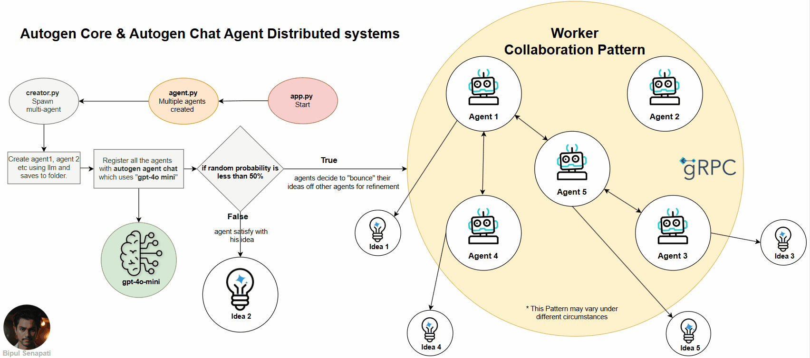

## Business Investing Agent Application: In build autonomous AI Agents to generate ideas
Agentic AI Application that helps generating ideas of your choice.



### Goal
- ✨ Designed to spark creativity, collaboration, and customization.
- You have the flexibility to customize the experience by selecting:
    > 🤖 Multi-agent architecture – Choose from different intelligent agents to collaborate on idea generation.

    > 💡 Areas of interest – Focus on domains you're passionate about or exploring.
    
    > 🧠 LLM of your choice

### Before you begin

I'm here to support your success in any way I can! If you ever have questions, need guidance, or just want to say hello, feel free to reach out — whether through the platform or directly via email at senapatibipul9@gmail.com.
I also love connecting with fellow developers, creators, and curious minds on LinkedIn.
🌐 https://linkedin.com/in/senapatibipul 

### Pre-requisites
😊 Must know *Autogen-core* & *Autogen Agent Chat*

🔑 OpenAI (Recommended)
The default model used is "gpt-4o-mini", provided by OpenAI.
To use it, you'll need to obtain your API key and set up billing via:

👉 OpenAI Billing Settings:https://platform.openai.com/settings/organization/billing/

🧠 Alternative Models
You can also experiment with other cutting-edge LLMs:

    Claude: claude-3-7-sonnet-latest

    Gemini: gemini-2.0-flash

    DeepSeek: deepseek-chat

These models may offer different strengths depending on your use case.

💸 Local & Cost-Effective Option (Ollama)
For a completely free and local alternative, use Ollama with models like llama3.2.

Here's a quick setup snippet:
```
from openai import OpenAI

ollama = OpenAI(base_url='http://localhost:11444/v1', api_key='ollama')
model_name = "llama3.2"

response = ollama.chat.completions.create(model=model_name, messages=messages)
```

### Steps to Approach
    1. Create a virtual env of your choice and install dependencies:
        Use venv	python -m venv llms && source llms/bin/activate
        Use conda	conda create -n llms python=3.10 && conda activate llms

        pip install -r requirement.txt

    2. To run application 
        uv run app.py

### Output Expectations
```
> Checkout Sample ideas on "src/ideas" folder from five different Worker agent.

> Checkout autonomus agent discussions on "src/agents" folder.

> Checkout Flow Diagram on assets folder
```